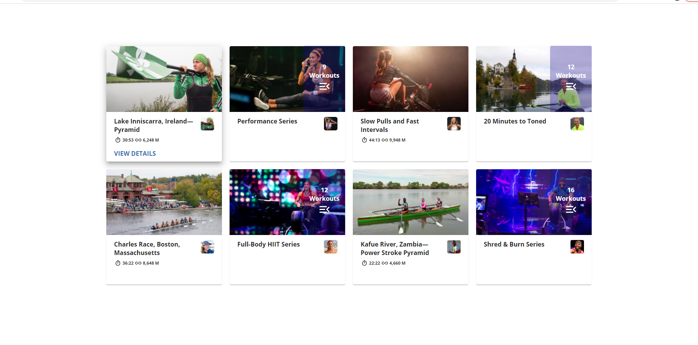

# App is deployed and hosted on GCP Firebase
### Desctop and mobile friendly
### Access the site at
### https://ifit-1b495.web.app/

## What do I do?

This repo includes a very basic initialization of the `create-react-app` framework, along with the challenge instructions.

Your task is to build out a single page section based on the provided designs (included below under Required Assets). Your work will be judged based on how well it matches the designs, how well you've implemented at least basic responsive functionality, and your code's cleanliness and structure.

In addition, we ask that you show off your state management skills by adding select functionality for each of the cards. When clicked, they should reflect the active state pictured in the designs (top left card, with increased box-shadow).

 It's okay to adjust any part of the initial project setup to fit your needs and desired workflow. Bonus points for showing off your animation chops!

## How do I submit?

Here's the ideal workflow:
- Fork this repository
- Make it look amazing
- Push your version up to a public repository
- Submit the link in your communications with our hiring department
- (Optional): host your code at a live URL and share that link, as well

## How long do I have?

Although there's no hard time limit, we ask that you shoot to complete the actual coding portion within 2 hours of starting (on your honor).

## Required Assets

All required images have been exported for your use and are included at the link below.

- [Design document and images](https://www.dropbox.com/sh/qszv92itgpf317c/AAAynYQ_ERvkm0e5MaDivyqfa?dl=0)
- [Open Sans font](https://fonts.google.com/specimen/Open+Sans)